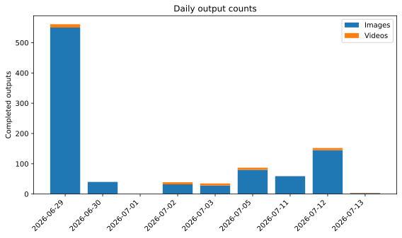
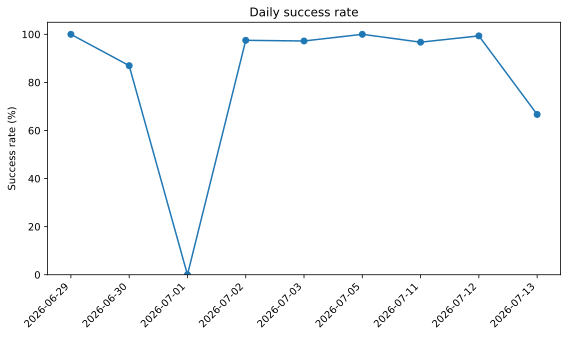
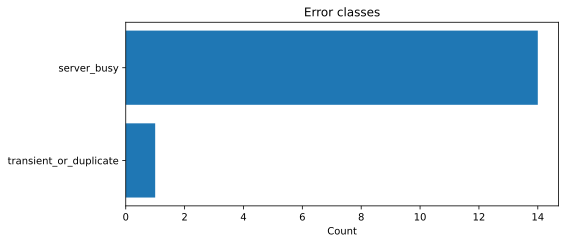

# Experiment Analytics

Generated from immutable release manifests and standalone JSONL metadata.

## Portfolio summary

| Metric | Value |
|---|---|
| Runs | 13 |
| Experiment dates | 9 |
| Images completed | 937 |
| Videos completed | 40 |
| Errors | 15 |
| Overall success | 98.5% |

## Recent dates

| Date | Runs | Images | Videos | Errors | Success | Mean latency (s) |
|---|---|---|---|---|---|---|
| 2026-07-13 | 1 | 3 | 1 | 2 | 66.7% | 111.3 |
| 2026-07-12 | 1 | 145 | 7 | 1 | 99.3% | 59.5 |
| 2026-07-11 | 1 | 59 | 0 | 2 | 96.7% | 53.5 |
| 2026-07-05 | 1 | 80 | 7 | 0 | 100.0% | 68.9 |
| 2026-07-03 | 1 | 28 | 7 | 1 | 97.2% | 84.3 |
| 2026-07-02 | 1 | 32 | 7 | 1 | 97.5% | 84.2 |
| 2026-07-01 | 1 | 0 | 0 | 2 | 0.0% | 22.5 |
| 2026-06-30 | 3 | 40 | 0 | 6 | 87.0% | 88.9 |
| 2026-06-29 | 3 | 550 | 11 | 0 | 100.0% | 135.2 |

## Charts

