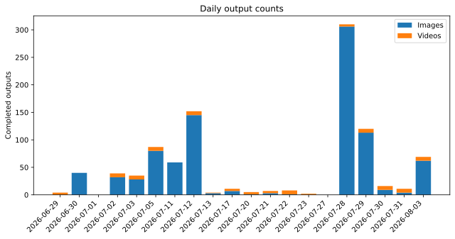
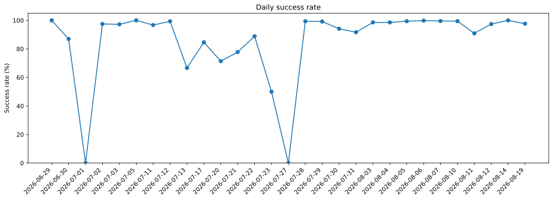
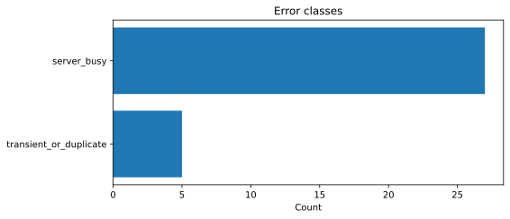

# Experiment Analytics

Generated from immutable release manifests and standalone JSONL metadata.

## Portfolio summary

| Metric | Value |
|---|---|
| Runs | 22 |
| Experiment dates | 20 |
| Images completed | 893 |
| Videos completed | 86 |
| Errors | 32 |
| Overall success | 96.8% |

## Recent dates

| Date | Runs | Images | Videos | Errors | Success | Mean latency (s) |
|---|---|---|---|---|---|---|
| 2026-08-03 | 1 | 62 | 7 | 1 | 98.6% | 90.1 |
| 2026-07-31 | 1 | 4 | 7 | 1 | 91.7% | 212.2 |
| 2026-07-30 | 1 | 9 | 7 | 1 | 94.1% | 142.1 |
| 2026-07-29 | 1 | 113 | 7 | 1 | 99.2% | 77.7 |
| 2026-07-28 | 1 | 306 | 4 | 2 | 99.4% | 59.4 |
| 2026-07-27 | 1 | 0 | 0 | 2 | 0.0% | 80.5 |
| 2026-07-23 | 1 | 0 | 2 | 2 | 50.0% | 142.0 |
| 2026-07-22 | 1 | 1 | 7 | 1 | 88.9% | 183.8 |
| 2026-07-21 | 1 | 3 | 4 | 2 | 77.8% | 164.7 |
| 2026-07-20 | 1 | 1 | 4 | 2 | 71.4% | 377.1 |
| 2026-07-17 | 1 | 7 | 4 | 2 | 84.6% | 130.2 |
| 2026-07-13 | 1 | 3 | 1 | 2 | 66.7% | 111.3 |
| 2026-07-12 | 1 | 145 | 7 | 1 | 99.3% | 59.5 |
| 2026-07-11 | 1 | 59 | 0 | 2 | 96.7% | 53.5 |
| 2026-07-05 | 1 | 80 | 7 | 0 | 100.0% | 68.9 |
| 2026-07-03 | 1 | 28 | 7 | 1 | 97.2% | 84.3 |
| 2026-07-02 | 1 | 32 | 7 | 1 | 97.5% | 84.2 |
| 2026-07-01 | 1 | 0 | 0 | 2 | 0.0% | 22.5 |
| 2026-06-30 | 3 | 40 | 0 | 6 | 87.0% | 88.9 |
| 2026-06-29 | 1 | 0 | 4 | 0 | 100.0% | 270.5 |

## Charts

